📘 AWS Disaster Recovery Setup Documentation

(Step-by-Step Guide: EFS, Backup, AMI, Disaster Testing)

🧩 Step 1: Launch EC2 Instances
Objective

Create EC2 instances to host application and storage for testing disaster recovery.

Steps
Go to AWS Console → EC2 → Instances
Click Launch Instance
Configure:
Name: ubuntu-app-1
AMI: Ubuntu 22.04
Instance type: t2.micro
Key pair: Create/select key
Configure network:
Select your VPC
Enable Auto-assign Public IP
Configure storage (default is fine)
Click Launch Instance
Validation
Instance should be in Running state
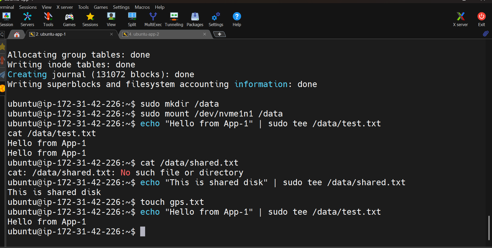

🧩 Step 2: Launch EC2 Instances
Objective

Create EC2 instances to host application and storage for testing disaster recovery.

Steps
Go to AWS Console → EC2 → Instances
Click Launch Instance
Configure:
Name: ubuntu-app-2
AMI: Ubuntu 22.04
Instance type: t2.micro
Key pair: Create/select key
Configure network:
Select your VPC
Enable Auto-assign Public IP
Configure storage (default is fine)
Click Launch Instance
Validation
Instance should be in Running state
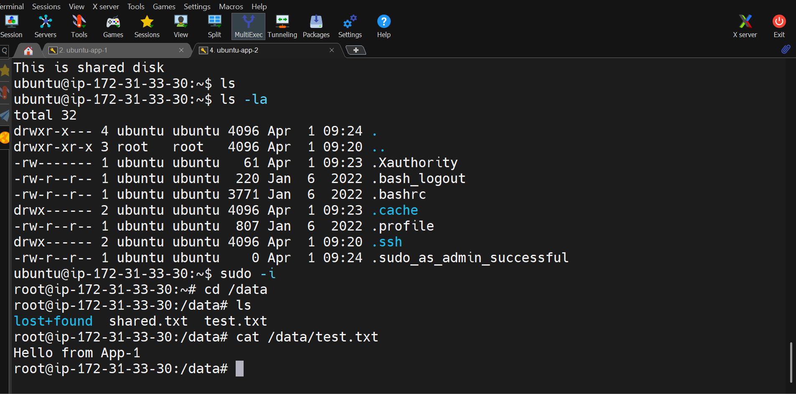

🧩 Step 3: Create and Attach EBS Volume
Objective

Create additional storage and attach it to EC2.

Steps
Go to EC2 → Volumes
Click Create Volume
Size: 100 GB
Availability Zone: same as EC2
Click Create Volume
Attach Volume
Select volume → Actions → Attach Volume
Select EC2 instance
Mount Volume (SSH into EC2)
lsblk
sudo mkfs -t ext4 /dev/xvdf
sudo mkdir /data
sudo mount /dev/xvdf /data
Validation
df -h

📸 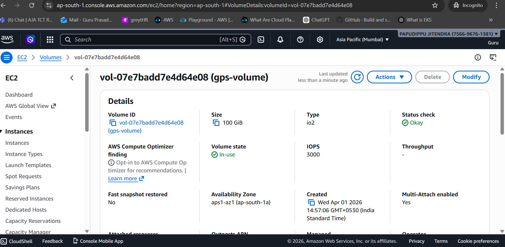

🧩 Step 4: Share EBS Across Instances (Optional)
Objective

Demonstrate shared storage setup.

Steps
Attach EBS to another instance (if supported)
Mount and verify access

🧩 Step 5: Create and Mount EFS
Objective

Set up scalable shared file storage.

🔹 5.1 Create EFS
Steps
Go to EFS → Create file system
Select your VPC
Add mount targets in multiple AZs
Configure lifecycle:
30 days → IA
90 days → Archive
Click Create

📸 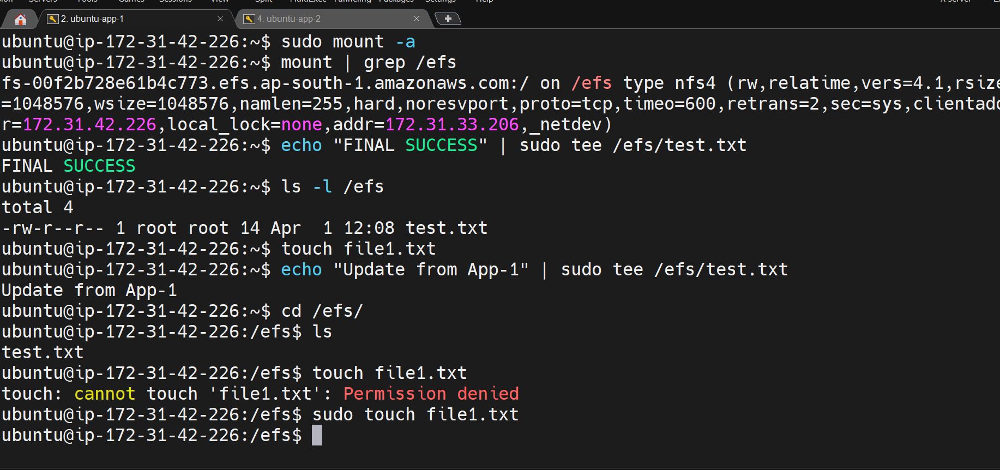

🔹 5.2 Mount EFS on EC2
Install NFS
sudo apt update
sudo apt install -y nfs-common
Mount EFS
sudo mkdir /efs
sudo mount -t nfs4 -o nfsvers=4.1 <efs-dns-name>:/ /efs
🔹 5.3 Make Persistent
sudo nano /etc/fstab

Add:

<efs-dns-name>:/ /efs nfs4 defaults,_netdev 0 0
🔹 5.4 Test
echo "efs test" > /efs/test.txt
cat /efs/test.txt

📸 

🔐 Step 6: AWS Backup Setup
Objective

Automate backup for EC2, EBS, and EFS.

🔹 6.1 Create Backup Vault
Go to AWS Backup → Backup vaults
Click Create vault
Name: dr-vault
Encryption: Default KMS

📸 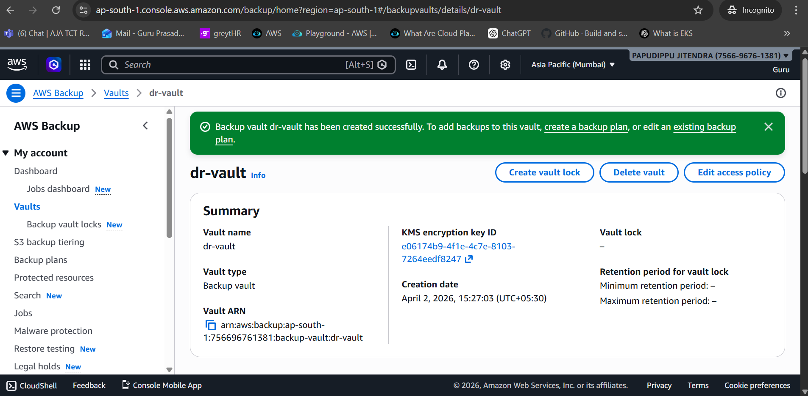

🔹 6.2 Create Backup Plan
Rule 1: EBS
Frequency: Hourly
Retention: 1 day
Rule 2: EFS + EC2
Frequency: Daily
Retention: 30 days
Rule 3: Cross-Region Copy
Destination: another region
Retention: 1 year

📸 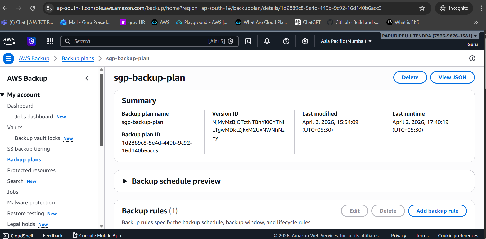

🔹 6.3 Assign Resources
Click Assign resources
Select:
EC2 instances
EBS volumes
EFS file system

📸 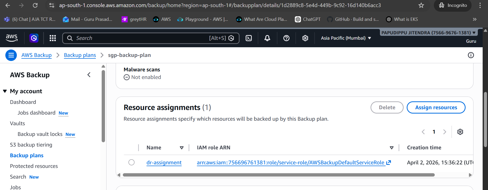

🔹 6.4 Run Backup
Go to Protected resources
Select resource
Click Create on-demand backup

📸 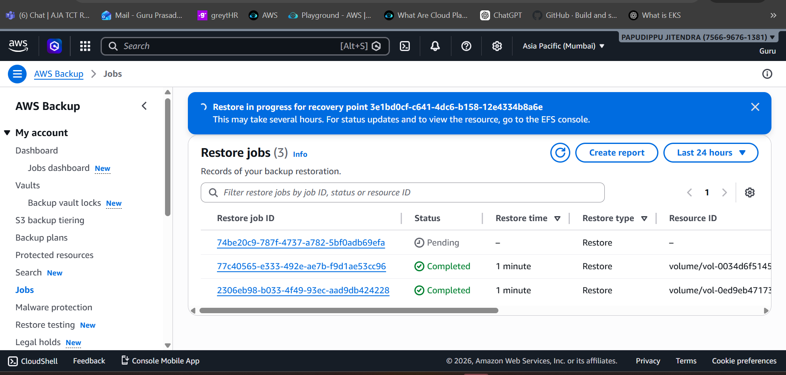

🔹 6.5 Verify Backup
Go to Backup vault
Confirm recovery points exist

📸 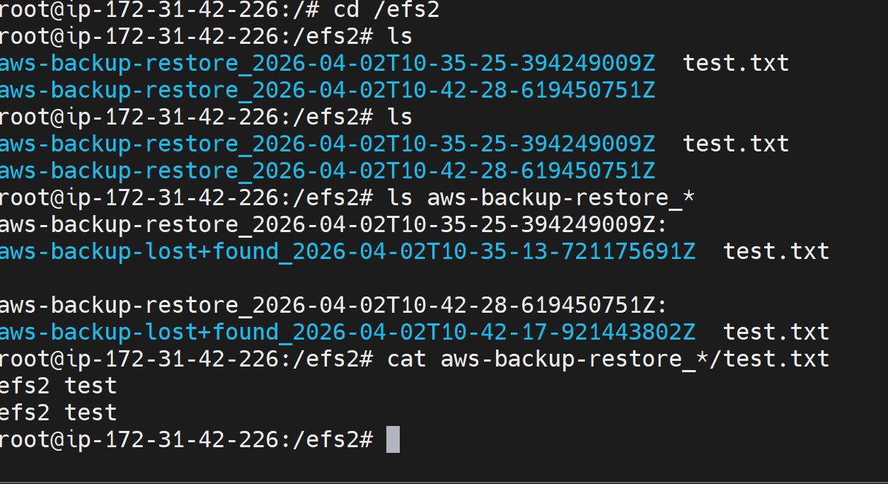

🖥️ Step 7: AMI Backup (EC2 Image)
Objective

Create full server backup.

🔹 Create AMI
Go to EC2 → Instances
Select instance
Click:
Actions → Image → Create Image

🔹 Launch from AMI
Go to AMIs
Select AMI
Click Launch instance

Validation
Instance launches successfully
Data is intact
🔥 Step 8: Disaster Simulation
Objective

Test recovery scenarios.

🔹 Test 1: EFS Recovery
Delete file
rm /efs/test.txt
Restore from backup
Go to AWS Backup
Restore EFS
Verify
ls /efs

📸 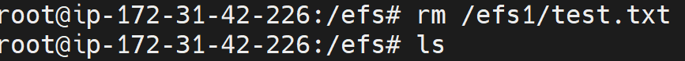

🔹 Test 2: EBS Restore
Delete volume
Restore from snapshot
Attach to EC2
lsblk
sudo mount /dev/xvdf /mnt

📸 

🔹 Test 3: Region Failure
Switch AWS region
Verify backup exists

📸 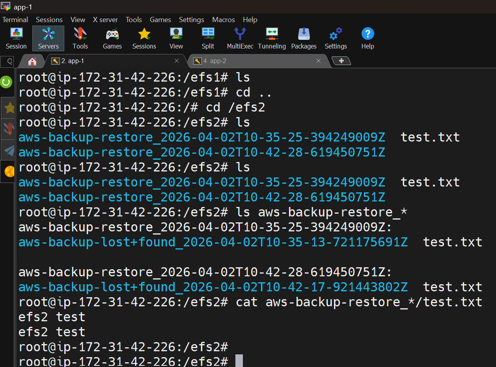

🔹 Test 4: AMI Restore
Launch EC2 from AMI
Verify application/data

✅ Final Validation Checklist

✔ Backup jobs completed
✔ EFS restore successful
✔ EBS restored
✔ EC2 launched from AMI
✔ Cross-region backup verified

🧠 Conclusion

This project demonstrates:

Automated backup strategy
Multi-layer disaster recovery
File, volume, and full system recovery
Cross-region resilience