AWS Microservices Architecture using S3 + ALB + EC2 + Lambda

🧠 Project Overview

This project demonstrates a simple microservices architecture using AWS services:

Frontend hosted on Amazon S3
Backend API running on EC2 instances
Authentication handled by AWS Lambda
Traffic routing managed by Application Load Balancer (ALB)
🏗️ Architecture
User → S3 (Frontend)
        ↓
     ALB (Routing)
      ↓       ↓
   EC2       Lambda
 (/users)   (/auth)
🧰 Services Used
Amazon S3 (Static Website Hosting)
Amazon EC2 (Backend API)
AWS Lambda (Authentication)
Application Load Balancer (ALB)
Target Groups
Security Groups
🚀 Step-by-Step Implementation
✅ STEP 1 — Create Frontend (S3)
🔹 1.1 Create S3 Bucket
Go to S3 → Create Bucket
Bucket name: my-simple-app-123
Disable Block Public Access

📸 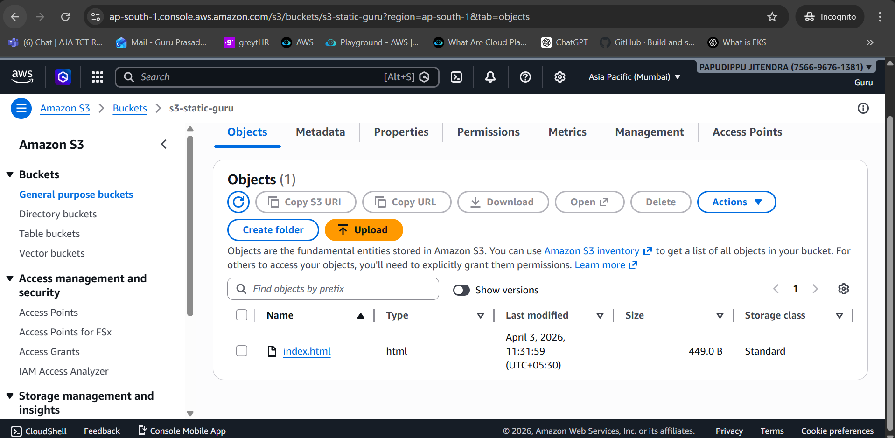

🔹 1.2 Create index.html

Create a file named index.html:

<!DOCTYPE html>
<html>
<body>

<h2>My App</h2>

<button onclick="callUsers()">Users API</button>
<button onclick="callAuth()">Auth API</button>

</body>
</html>

📸 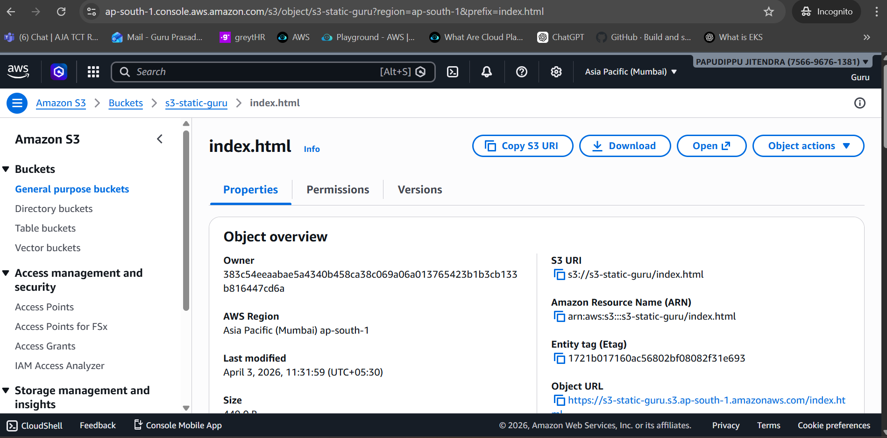

🔹 1.3 Upload File to S3
Open bucket → Upload → Add file
Upload index.html

📸 

🔹 1.4 Enable Static Website Hosting
Go to Properties
Enable Static Website Hosting
Index document: index.html

📸 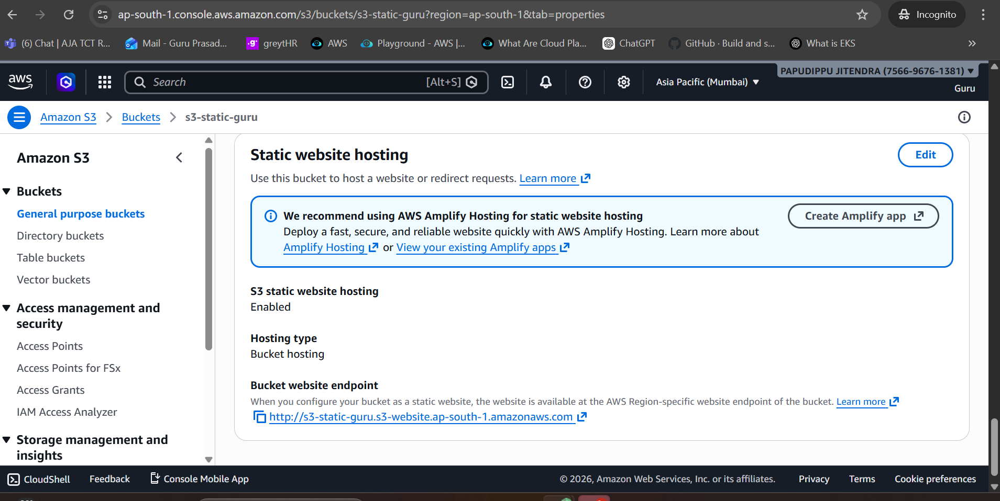

🔹 1.5 Add CORS Policy
[
  {
    "AllowedOrigins": ["*"],
    "AllowedMethods": ["GET"],
    "AllowedHeaders": ["*"]
  }
]

📸 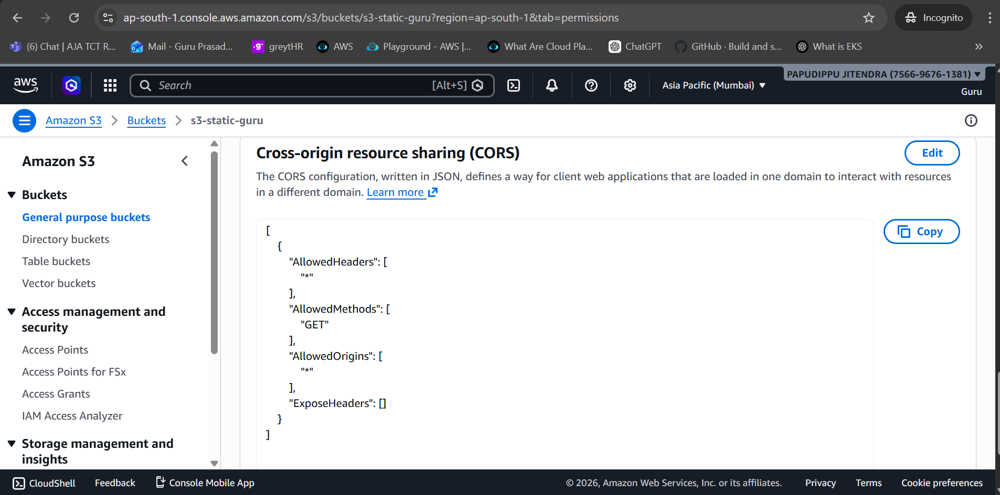

✅ STEP 2 — Create Backend (EC2)
🔹 2.1 Launch EC2 Instances
AMI: Ubuntu / Amazon Linux
Instance type: t2.micro
Allow HTTP (port 80)

📸 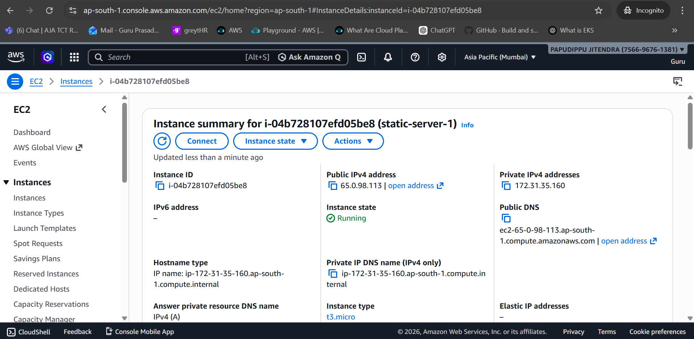

🔹 2.2 Install Apache

SSH into instance:

sudo apt update
sudo apt install apache2 -y
sudo systemctl start apache2
🔹 2.3 Add Custom Response
sudo nano /var/www/html/index.html

Paste:

<h1>Hello from EC2 API</h1>

Restart:

sudo systemctl restart apache2

📸 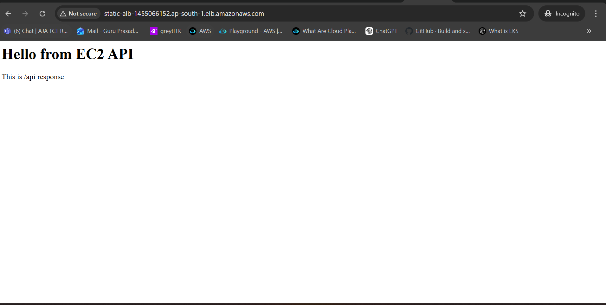

✅ STEP 3 — Create Lambda Function
🔹 3.1 Create Function
Go to Lambda → Create Function
Name: auth-function
Runtime: Python 3.x

📸 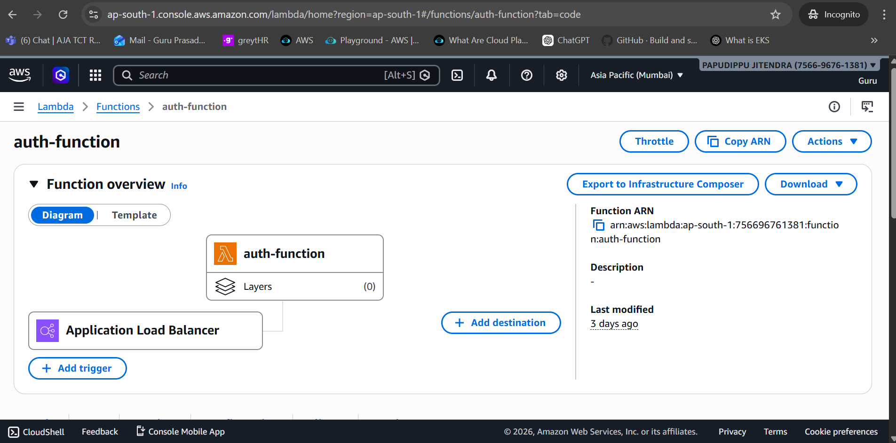

🔹 3.2 Add Code
def lambda_handler(event, context):
    return {
        'statusCode': 200,
        'body': 'Auth success!'
    }

Click Deploy

📸 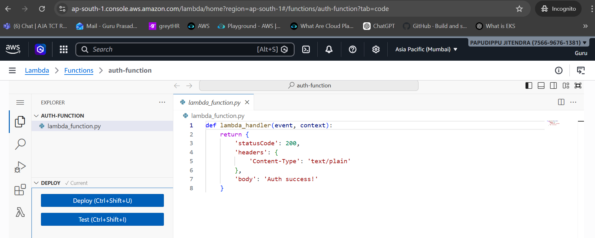

✅ STEP 4 — Create Target Groups
🔹 4.1 EC2 Target Group
Type: Instances
Add EC2 instances

📸 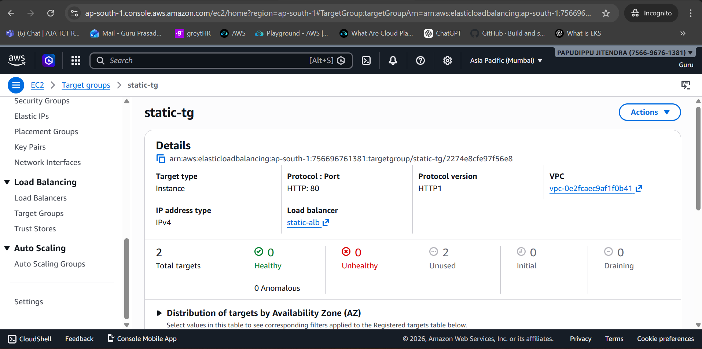

🔹 4.2 Lambda Target Group
Type: Lambda
Select auth-function

📸 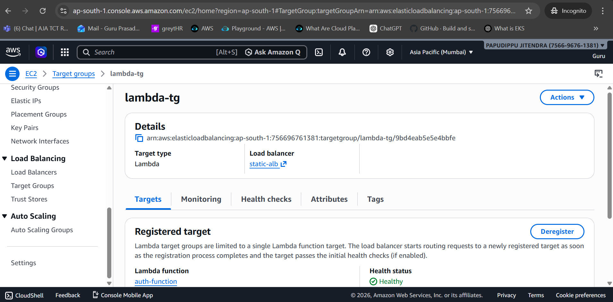

✅ STEP 5 — Create Application Load Balancer
🔹 5.1 Create ALB
Type: Application Load Balancer
Internet-facing
Listener: HTTP (80)
Select subnets

📸 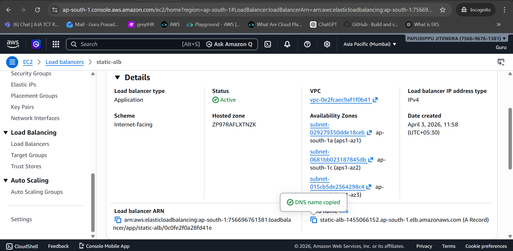

🔹 5.2 Attach Target Group
Default target group → EC2 TG
✅ STEP 6 — Configure Routing Rules

Go to:
ALB → Listeners → Rules

🔹 Rule 1 (Lambda)
Path: /api/auth/*
Forward → Lambda TG
Priority: 1
🔹 Rule 2 (EC2)
Path: /api/*
Forward → EC2 TG
Priority: 2

📸 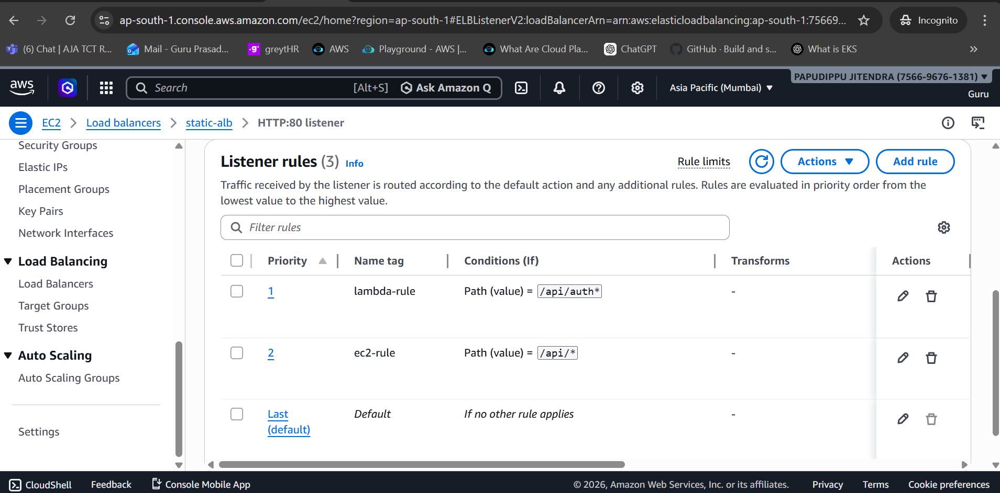

✅ STEP 7 — Testing
🔹 7.1 Get ALB DNS

Example:

http://your-alb-dns.amazonaws.com
🔹 7.2 Test APIs
EC2:
/api/users
Lambda:
/api/auth

📸 
   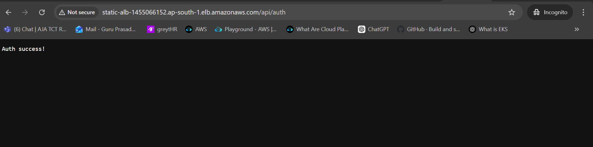
✅ STEP 8 — Connect Frontend

Update index.html:

fetch("http://YOUR-REAL-ALB-DNS/api/users")

Re-upload to S3

📸 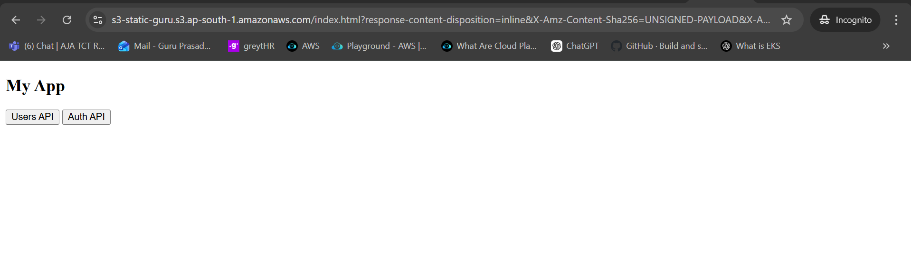

🎉 Final Output
Website loads from S3
Button → EC2 response
Button → Lambda response
🧩 Key Learnings
Path-based routing using ALB
Integration of EC2 and Lambda
Static website hosting with S3
Real-world microservices architecture